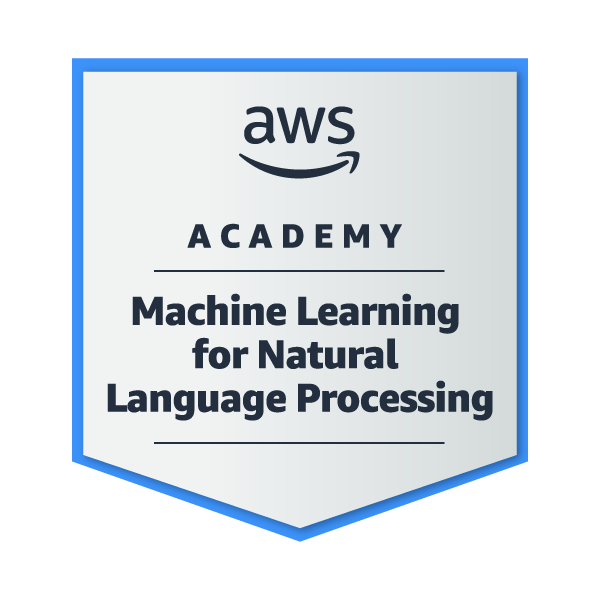

 

<h2 align="center">🎓 My Multi-Cloud Certifications</h2>

<table>
  <tr>
    <!-- Icon Row -->
    <td align="center">
      
    </td>
    <td align="center">
      
    </td>
    <td align="center">
      
    </td>
    <td align="center">
      
    </td>
  </tr>
  <tr>
    <!-- Text Row -->
    <td align="center">
      🗓️ December 2024  
      🔗 <a href="https://www.credly.com/badges/97d96a7c-06f8-4537-a102-d0a41184ae6f">Credential</a> 
      <em>Validates AWS Machine Learning with Natural Language Processing.</em>
    </td>
    <td align="center">
      🗓️ December 2024  
      🔗 <a href="https://www.credly.com/badges/1c93f69a-6969-4cb6-a1c5-3ed7d5baba6d">Credential</a> 
      <em>Covers Machine Learning foundations.</em>
    </td>
    <td align="center">
      🗓️ November 2024  
      🔗 <a href="https://www.credly.com/badges/e127022f-3ecb-48cb-9156-bfba9335e9b5">Credential</a> 
      <em>Validated Data Science knowledge.</em>
    </td>
    <td align="center">
      🗓️ November 2024  
      🔗 <a href="https://www.credly.com/badges/364c325d-78fd-483d-b516-3af698fa6b4d">Credential</a> 
      <em>Validates AWS Cloud concepts, billing, and infrastructure.</em>
    </td>
  </tr>
</table>

### 👩‍💻 Main skills

 

### 🤓 Studying

 

## ✍️ Github Status

&nbsp;

 

 ##  🏆 Github Trophies
  

  

 
 ## 📈Contribution's Graph
 

